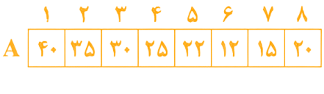
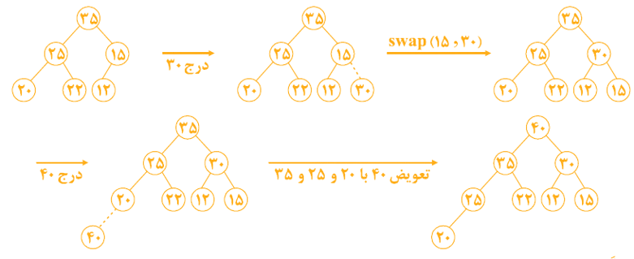
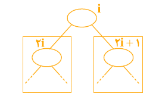
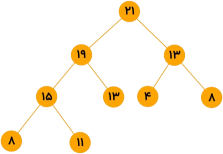

# 📚 هرم دودویی | Binary Heap

هرم دودویی برای ساخت صف اولویت و همچنین مرتب‌سازی کاربرد دارد.

هرم‌های دودویی به دو دسته تقسیم می‌شوند:

### 🧩 هرم دودویی کمینه | Binary Minheap
یک درخت دودویی کامل است که در هر نود آن یک کلید (عدد) وجود دارد و کلید هر نود از کلید فرزندان آن نود، کوچک‌تر یا مساوی است.

### 🧩 هرم دودویی بیشینه | Binary Maxheap
یک درخت دودویی کامل است که در هر نود آن یک کلید (عدد) وجود دارد و کلید هر نود از کلید فرزندان آن نود، بزرگ‌تر یا مساوی است.

  

### ⚠️ یادآوری

 درخت دودویی کامل، همۀ سطوح ماقبل آخرش پر می‌باشد و نودها در سطح آخر آن، از چپ قرار می‌گیرند. درخت دودویی کامل شامل n گره را می‌توان با آرایۀ $\large{A[1, ..., n]}$ نشان داد که $\large{A\left[1, ..., \Bigl\lfloor\frac{n}{2}\Bigr\rfloor\right]}$ گره‌های داخلی و $\large{A\left[\Bigl\lfloor\frac{n}{2}\Bigr\rfloor + 1, ..., n\right]}$ گره‌های خارجی (برگ) هستند.

در درخت دودویی کامل، روابط پدر و فرزندی به شکل زیر است:

  
$`\Large{Parent(i) = \Bigl\lfloor\frac{i}{2}\Bigr\rfloor \;\;\;\;\;\;\;\;\;\;\;\;\;\;\;\;\;\;\;\;\;\;\;(i \geqslant 1)}`$

$`\Large{Left(i) = 2i \;\;\;\;\;\;\;\;\;\;\;\;\;\;\;\;\;\;\;\;\;\;\;\;\;\;\;(2i \leqslant n)}`$

$`\Large{Right(i) = 2i + 1 \;\;\;\;\;\;\;\;\;\;\;\;\;(2i + 1 \leqslant n)}`$

تشخیص اینکه آرایۀ $\large{A[1, ..., n]}$، یک Minheap یا Maxheap است، از مرتبۀ $\boldsymbol{\mathcal{O}(n)}$ است. زیرا باید ...

## 💡 نکات مهم
با توجه به ساختار هرم کمینه و هرم بیشینه، به راحتی می‌توان نکات زیر را استنباط کرد:

### 📌 هرم بیشینه
در هرم بیشینه، بزرگ‌ترین کلید در ریشه است و کوچک‌ترین کلید در یکی از برگ‌هاست. پس در Maxheap یافتن ماکزیمم از مرتبۀ $\boldsymbol{\theta(1)}$، و یافتن مینیمم از مرتبۀ $\boldsymbol{\theta(n)}$ می‌باشد، زیرا برای یافتن ماکزیمم باید تمام $\Bigl\lceil\frac{n}{2}\Bigr\rceil$ برگ، بررسی شوند.

### 📌 هرم کمینه
در هرم کمینه، کوچک‌ترین کلید در ریشه است و بزرگ‌ترین کلید در یکی از برگ‌هاست. پس در Minheap یافتن مینیمم از مرتبۀ $\boldsymbol{\theta(1)}$، و یافتن ماکزیمم از مرتبۀ $\boldsymbol{\theta(n)}$ می‌باشد، زیرا برای یافتن مینمم باید تمام $\Bigl\lceil\frac{n}{2}\Bigr\rceil$ برگ، بررسی شوند.

### 📌 ارتفاع هرم
از آنجایی که هرم درخت کامل است، پس تعداد سطوح هرم با n گره، برابر $\lfloor\log n\rfloor + 1$ است. در نتیجه ارتفاع هرم برابر $\lfloor\log n\rfloor$ است.

## 📥 درج در هرم بیشینه

می‌خواهیم کلید x را در هرم بیشینه درج کنیم. از آنجایی که هرم درخت دودویی کامل است، کلید x را در انتهای هرم یعنی در اولین مکان خالی، قرار می‌دهیم؛ سپس x را با اجدادش مقایسه می‌کنیم و تا زمانی که x از پدرش بزرگ‌تر است، جای x را با پدرش عوض می‌کنیم.

**مثال)** ابتدا کلید 30 و سپس کلید 40 را در هرم بیشینه درج کنید.

  

طول آرایه (Length(A)) برابر 8 است که ثابت است. تعداد عناصر موجود در هرم (Heapsize(A)) برابر 6 است. با هر عمل درج، یک واحد به Heapsize اضافه می‌شود.

**مرحله اول درج کلید 30**

این کلید را در A[7] قرار می‌دهیم (Heapsize برابر 7 می‌شود). سپس 30 را با A[3] = 15 مقایسه می‌کنیم و چون $15 < 30$ است، باید 30 با 15 جابه‌جا شود. حالا 30 را با A[1] = 35 مقایسه می‌کنیم و چون $30 < 35$ است، نیازی به جابه‌جایی نیست.

  

**مرحله دوم درج کلید 40**

این کلید را در A[8] قرار می‌دهیم (Heapsize برابر 8 می‌شود). ابتدا 40 را با A[4] = 20 مقایسه می‌کنیم و چون $20 < 40$ است، باید 40 با 20 جابه‌جا شود. سپس 40 را با A[2] = 25 مقایسه می‌کنیم و چون $25 < 40$ است، باید 40 با 25 جابه‌جا شود. حالا 40 را با A[1] = 35 مقایسه می‌کنیم و چون $35 < 40$ است، 40 با 35 جابه‌جا می‌شود.

  

برای درک بهتر مثال، شکل درخت را در هر مرحله می‌کشیم:

  

پس جمعا با 4 جابه‌جایی، کلیدهای 30 و 40 در هرم بیشینه درج شدند.

زمان اجرای درج یک کلید، به ارتفاع درخت وابسته است و چون ارتفاع درخت کامل شامل n گره، برابر $\lfloor\log n\rfloor$ است، پس عمل درج یک کلید در هرم، از مرتبۀ $\boldsymbol{\mathcal{O}(\log n)}$ می‌باشد.

## الگوریتم بازسازی هرم | Maxheapify

این الگوریتم، اندیس i را دریافت می‌کند. هنگام فراخوانی این الگوریتم با اندیس i، باید زیردرختان چپ و راست اندیس i (یعنی زیردرختان با ریشۀ A[2i] و A[2i + 1])، خود هرم بیشینه باشند و احتمالا عنصر A[i] ممکن است از فرزندانش کوچک‌تر باشد. این الگوریتم عنصر A[i] را با فرزندانش (A[2i] و A[2i + 1]) مقایسه می‌کند و اگر خاصیت هرم بیشینه نقض شده باشد، یعنی اگر A[i] از فرزندانش (یا از یک فرزندش) کوچک‌تر باشد، A[i] را با بزرگ‌ترین فرزندش جابه‌جا می‌کند و سپس همین عمل را روی فرزند A[i] انجام می‌دهد.

  

پس الگوریتم بازسازی هرم اگر روی i انجام شود، عنصر A[i] را در صورت لزوم با بزرگ‌ترین فرزندش جابه‌جا می‌کند و به صورت بازگشتی همین فرایند را ادامه می‌دهد.

مرتبۀ این الگوریتم روی هرم n عنصری، $\boldsymbol{\mathcal{O}(\log n)}$ است زیرا زمان این الگوریتم به ارتفاع درخت وابسته است. البته اگر بخواهیم دقیق‌تر بیان کنیم، زمان این الگوریتم به ارتفاع A[i] بستگی دارد پس بهتر است بگوییم زمان این الگوریتم از مرتبۀ $\boldsymbol{\mathcal{O}(\log \frac{n}{i})}$ است.

## ساخت هرم بیشینه | Build Maxheap

می‌خواهیم با n عنصر موجود در $A[1, ..., n]$، یک هرم بیشینه بسازیم. دو روش برای این منظور وجود دارد:

### روش اول

ژ n بار عمل Maxheapinsert را اجرا کنیم. یعنی به ترتیب A[1]، سپس A[2]، سپس A[3] و به همین ترتیب تا A[n] را درج کنیم. البته می‌توان عمل درج را از A[2] تا A[n] انجام داد. واضح است که مرتبۀ این روش $\boldsymbol{\mathcal{O}(n\log n)}$ می‌باشد.

### روش دوم

از الگوریتم Maxheapify کمک بگیریم. به این صورت که از آخرین عنصر داخلی یعنی از $A\left[\Bigl\lfloor\frac{n}{2}\Bigr\rfloor\right]$ تا عنصر A[1]، عمل Maxheapify را فراخوانی کنیم. واضح است که مرتبۀ این روش $\boldsymbol{\theta(n)}$ می‌باشد.

### نکته

روش دوم از روش اول سریع‌تر است. همان‌طور که گفته شد، مرتبۀ روش اول $\boldsymbol{\mathcal{O}(n\log n)}$ و مرتبۀ روش دوم $\boldsymbol{\theta(n)}$ است. ولی روش دوم را فقط در شرایطی می‌توان استفاده کرد که همۀ عناصر در اختیار باشند. یعنی اگر قرار باشد عناصر بعداً وارد شوند، باید از روش اول استفاده شود و با ورود هر عنصر، درج انجام شود.

## حذف عنصر کمینه از هرم کمینه بیشینه

عضو کمینۀ هرم در A[1] است. برای حذف این عنصر، عنصر آخر هرم را x می‌نامیم؛ سپس کلید ریشه را حذف می‌کنیم و x  را در ریشه قرار می‌دهیم.   
توجه: x را در ریشه می‌گذاریم و از جای قبلی خود حذف می‌کنیم.  
اگر ریشه فرزند نداشته باشد (یعنی هرم اولیه، حداقل ۲ نود داشته است) کار تمام است؛ ولی اگر حداقل یک فرزند داشته باشد، عنصر کمینه را بین دو فرزند و چهار نوۀ ریشه، یعنی در بین عناصر A[2] تا A[7] می‌یابیم. فرض کنید عنصر کمینه A[m] = y باشد. حال اگر $x \leqslant y$ باشد، کافی است x را در ریشه قرار دهیم و کار تمام است. اگر $x > y$ و y فرزند ریشه باشد، از آن‌جایی که y در سطح max قرار دارد، پس هیچ نواده‌ای ندارد و کافی است y را در ریشه و x را به‌جای y قرار دهیم. اگر $x > y$ و y نوۀ ریشه باشد، ابتدا پدر y را p می‌نامیم، سپس y را به ریشه  و x را به محل قدیم y یعنی A[m] منتقل می‌کنیم. حال اگر $x > p$ باشد، ابتدا p  و x را جابه‌جا می‌کنیم؛ سپس تمام عملیات فوق را روی A[m] انجام می‌دهیم.

## حذف عنصر بیشینه از هرم کمینه بیشینه

عنصر بیشینۀ هرم $A[1, ..., n]$ در A[1] قرار دارد. برای حذف این عنصر، آخرین عنصر هرم را به جای آن قرار دهید و مشابه روال گفته شده برای حذف عنصر کمینه، هرم را بازسازی کنید.

### نکته

ساخت هرم کمینه بیشینه، روالی مشابه ساخت هرم کمینه یا هرم بیشینه دارد. با n عدد می‌توان با مرتبۀ $\boldsymbol{\theta(n)}$ یک هرم کمینه بیشینه ساخت.

### نکته

کاربرد اصلی هرم کمینه بیشینه، ساخت صف اولویت دو طرفه (Double ended priority queue) است. در این نوع صف، باید بتوان عملیات درج یک عنصر با کلید دلخواه، حذف عنصر با کمترین کلید و حذف عنصر با بیشترین کلید را با سرعت خوبی انجام داد؛ که تمام این عملیات‌ها در هرم کمینه بیشینه با مرتبۀ $\boldsymbol{\mathcal{O}(\log n)}$ قابل انجام است. همچنین یافتن عنصر کمینه و عنصر بیشینه در این هرم از مرتبۀ $\boldsymbol{\mathcal{O}(1)}$ است.

## 📝 سوالات

---

**سوال ۱)** با آرایۀ زیر، هرم بیشینه بسازید.

👀 پاسخ

گزینه فلان ✅

> توضیحات

---

**سوال ۲)** الگوریتم maxheapify را روی اندیس 1 در آرایۀ A اجرا کنید. (Maxheapify(A, 1))

👀 پاسخ

گزینه فلان ✅

> توضیحات

---

**سوال ۳)** آیا آرایۀ زیر، نشان‌دهنده یک هرم بیشینه است؟

👀 پاسخ

گزینه فلان ✅

> توضیحات

---

**سوال ۴)** با کلیدهای 1 تا 7، چند هرم کمینه شامل 7 گره با کلیدهای متمایز می‌توان ساخت؟

👀 پاسخ

گزینه فلان ✅

> توضیحات

---

**سوال ۵)** گزینه صحیح را انتخاب کنید.8

(علوم کامپیوتر ۸۰)

گزینه ۱) حداکثر عمق درخت جستجوی باینری برابر با $\boldsymbol{\mathcal{O}(\log n)}$ است.  
گزینه ۲) حداکثر عمق درخت باینری heap برابر با $\boldsymbol{\mathcal{O}(n)}$ است.  
گزینه ۳) حداکثر عمق درخت جستجوی باینری برابر با $\boldsymbol{\mathcal{O}(n)}$ است.  
گزینه ۴) حداکثر عمق درخت باینری heap و نصف جستجوی باینری برابر با $\boldsymbol{\mathcal{O}(\log n)}$ است.

👀 پاسخ

گزینه ۳ ✅

---

**سوال ۶)** یک Maxheap با n عنصر به صورت آرایه پیاده‌سازی شده است. (عنصر ماکزیمم در ریشه است). مناسب‌ترین گزینه برای پیدا کردن عنصر مینیمم در این ساختمان داده کدام است؟ 9

(دولتی ۸۱)

گزینه ۱) این کار را همواه می‌توان با $\boldsymbol{\mathcal{O}(\log n)}$ مقایسه بین عناصر heap انجام داد.  
گزینه ۲) این کار به حداکثر $\frac{n}{2}$ مقایسه بین عناصر heap نیاز دارد.  
گزینه ۳) این کار ممکن است به $n - 1$ مقایسه بین عناصر heap نیاز داشته باشد.  
گزینه ۴) تنها در صورتی که heap عناصر تکراری نداشته باشد، می‌توان این کار را با $\boldsymbol{\mathcal{O}(\log n)}$ مقایسه بین عناصر heap انجام داد.

👀 پاسخ

گزینه ۲ ✅

---

**سوال ۷)** آرایه n خانه‌ای A را در نظر می‌گیریم که برای ذخیره‌سازی عناصر یک درخت دودویی مورد استفاده قرار گرفته است. فرض کنید الگوریتمی کارا را برای بررسی اینکه درخت دودویی یک heap است یا خیر را در اختیار داریم. پیچیدگی این الگوریتم در بدترین حالت چقدر است؟ 10

(دولتی ۸۱)

گزینه ۱) $\boldsymbol{\mathcal{O}(n)}$  
گزینه ۲) $\boldsymbol{\mathcal{O}(n ^ 2)}$  
گزینه ۳) $\boldsymbol{\mathcal{O}(\log n)}$  
گزینه ۴) $\boldsymbol{\mathcal{O}(n \log n)}$

👀 پاسخ

گزینه ۱ ✅

---

**سوال ۸)** صف اولویت (Priority queue) با استفاده از heap پیاده‌سازی شده است. کدام یک از عبارات زیر صحیح است؟ (n تعداد اقلام در صف اولویت می‌باشد.) 11

(دولتی ۸۱)

گزینه ۱) عمل‌گر «پیدا کردن ماکزیمم و حذف آن» از صف اولویت دارای پیچیدگی زمانی $\boldsymbol{\mathcal{O}(1)}$ می‌باشد.  
گزینه ۲) عمل‌گر «اضافه کردن» یک قلم جدید به صف اولویت دارای پیچیدگی زمانی $\boldsymbol{\mathcal{O}(n \log n)}$ می‌باشد.  
گزینه ۳) عمل‌گر «پیدا کردن ماکزیمم» دارای پیچیدگی زمانی $\boldsymbol{\mathcal{O}(\log n)}$ می‌باشد.  
گزینه ۴) عمل‌گر «اضافه کردن» یک قلم جدید به صف اولویت دارای پیچیدگی زمانی $\boldsymbol{\mathcal{O}(\log n)}$ می‌باشد.

👀 پاسخ

گزینه ۴ ✅

---

**سوال ۹)** اگر یک گره از Maxheap درخت زیر حذف شود، دادۀ آخرین سطح درخت چیست؟ 12

(دولتی ۸۱)

گزینه ۱) ۱۱  
گزینه ۲) ۱۵  
گزینه ۳) ۸  
گزینه ۴) ۲۱

👀 پاسخ

گزینه ۳ ✅

---

**سوال ۱۰)** پس از حذف (یا اضافه کردن) یک عنصر، می‌توان هرم (heap) را مجدداً ..................................... 13

(علوم کامپیوتر سراسری ۸۱)

گزینه ۱) در زمان $\boldsymbol{n ^ 2}$ بازسازی کرد.  
گزینه ۲) در زمان $\boldsymbol{n \log n}$ بازسازی کرد.  
گزینه ۳) در زمان $\boldsymbol{\log n}$ بازسازی کرد.  
گزینه ۴) هیچ‌کدام

👀 پاسخ

گزینه ۳ ✅

---

**سوال ۱۱)** ماکزیمم تعداد مقایسه برای Minheap کردن یک Maxheap با n گره برابر است با: 14

(علوم کامپیوتر ۸۳)

گزینه ۱) $\boldsymbol{\mathcal{O}(n + \log n)}$  
گزینه ۲) $\boldsymbol{\mathcal{O}(\log n)}$  
گزینه ۳) $\boldsymbol{\mathcal{O}(n \log n)}$  
گزینه ۴) $\boldsymbol{\mathcal{O}(2n)}$

👀 پاسخ

گزینه ۴ ✅

---

**سوال ۱۲)** اگر در یک Minheap دلخواه جای زیردرخت‌های چپ و راست تعویض شود، در آن صورت کدام گزینه صحیح است؟ 15

(علوم کامپیوتر ۸۵)

گزینه ۱) همیشه ساختار Minheap از بین می‌رود.  
گزینه ۲) ساختار Minheap تبدیل به Maxheap می‌شود.  
گزینه ۳) در برخی از شرایط ساختار Minheap از بین می‌رود.  
گزینه ۴) در هیچ شرایطی ساختار Minheap از بین نمی‌رود.

👀 پاسخ

گزینه ۳ ✅

---

**سوال ۱۳)** سومین کوچک‌ترین کلید در یک Minheap با کلیدهای متمایز در درایه‌هایی با چه اندیس‌هایی می‌تواند باشد؟ 16

(۸۶ IT)

گزینه ۱) ۳ و ۲ و ۱  
گزینه ۲) ۷ و ۶ و ۵ و ۴ و ۳ و ۲  
گزینه ۳) ۷ و ۶ و ۵ و ۴  
گزینه ۴) ۷ و ۶ و ۵ و ۴ و ۳ و ۲ و ۱  

👀 پاسخ

گزینه ۲ ✅

---

**سوال ۱۴)** یک Maxheap با n عنصر را که در آرایۀ $A[1, ..., n]$ قرار دارد، در نظر بگیرید. مرتبۀ زمانی الگوریتم حذف عنصر iام $(1 \leqslant i \leqslant n)$ از این Maxheap به گونه‌ای که ساختار Maxheap را حفظ کند، چیست؟ 17

(۹۰ IT)

گزینه ۱) $\boldsymbol{1}$  
گزینه ۲) $\boldsymbol{n \log n}$  
گزینه ۳) $\boldsymbol{\log n}$  
گزینه ۴) $\boldsymbol{n}$

👀 پاسخ

گزینه ۳ ✅

---

**سوال ۱۵)** کدام‌یک از اعمال زیر را نمی‌توان در یک Maxheap با n عنصر در مرتبۀ $\boldsymbol{\mathcal{O}(\log n)}$ انجام داد؟ 18

(مهندسی ۸۸)

گزینه ۱) یافتن یک عنصر با کلید مشخص  
گزینه ۲) حذف یک عنصر داده شده  
گزینه ۳) کاهش مقدار کلید یک عنصر داده شده  
گزینه ۴) افزایش مقدار کلید یک عنصر داده شده

👀 پاسخ

گزینه ۱ ✅

---

**سوال ۱۶)** چند Minheap متفاوت می‌توان با ۷ گره با کلیدهای ۱ تا ۷ ساخت؟ 19

(۹۰و۸۸ IT)

گزینه ۱) ۱۶۰  
گزینه ۲) ۸۰  
گزینه ۳) ۴۰  
گزینه ۴) ۲۰

👀 پاسخ

گزینه ۲ ✅

---

**سوال ۱۷)** نمی‌توان ساختمان داده‌ای برای n عنصر طراحی کرد که ..................................... 20

(مهندس ۸۷)

گزینه ۱) ساخت آن $\boldsymbol{\mathcal{O}(n \log n)}$ و حذف بزرگ‌ترین عنصر آن، درج و حذف کلید یک عنصر دلخواه در آن $\boldsymbol{\mathcal{O}(\log n)}$ باشد.  
گزینه ۲) ساخت آن $\boldsymbol{\mathcal{O}(n)}$ و حذف بزرگ‌ترین عنصر آن، درج، حذف، افزایش و کاهش کلید یک عنصر دلخواه در آن $\boldsymbol{\mathcal{O}(\log n)}$ باشد.  
گزینه ۳) ساخت آن $\boldsymbol{\mathcal{O}(n)}$ و حذف بزرگ‌ترین عنصر آن، حذف و افزایش کلید یک عنصر دلخواه در آن $\boldsymbol{\mathcal{O}(\log n)}$ باشد.  
گزینه ۴) ساخت آن $\boldsymbol{\mathcal{O}(n)}$ و حذف بزرگ‌ترین عنصر آن، $\boldsymbol{\mathcal{O}(1)}$ و درج و حذف کلید یک عنصر دلخواه در آن $\boldsymbol{\mathcal{O}(\log n)}$ باشد.

👀 پاسخ

گزینه ۴ ✅

---

