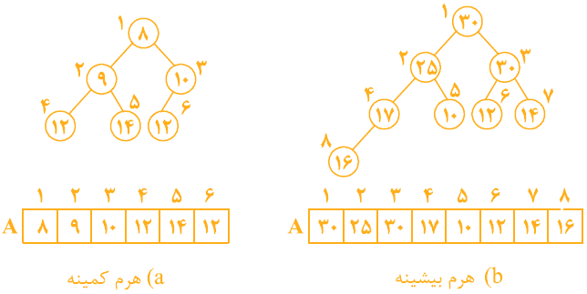
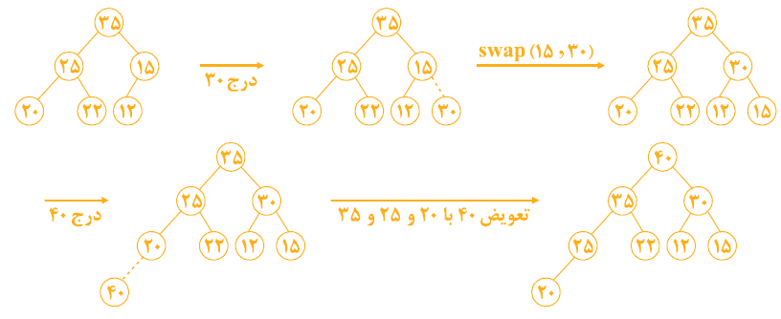
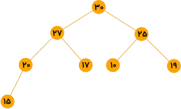

<div dir="rtl" align="right">


# 📚 هرم دودویی | Binary Heap

هرم دودویی برای **ساخت صف اولویت** و همچنین **مرتب‌سازی** کاربرد دارد.

هرم‌های دودویی به دو دسته تقسیم می‌شوند:

### 🧩 هرم دودویی کمینه | Binary Minheap
یک **درخت دودویی کامل** است که در هر نود آن یک کلید (عدد) وجود دارد و کلید هر نود از کلید فرزندان آن نود، **کوچک‌تر یا مساوی** است.

### 🧩 هرم دودویی بیشینه | Binary Maxheap
یک **درخت دودویی کامل** است که در هر نود آن یک کلید (عدد) وجود دارد و کلید هر نود از کلید فرزندان آن نود، **بزرگ‌تر یا مساوی** است.

<div align="center">
  


</div>


### ⚠️ یادآوری

 درخت دودویی کامل، همۀ سطوح ماقبل آخرش پر می‌باشد و نودها در سطح آخر آن، از چپ قرار می‌گیرند. درخت دودویی کامل شامل n گره را می‌توان با آرایۀ $\large{A[1, ..., n]}$ نشان داد که $\large{A\left[1, ..., \Bigl\lfloor\frac{n}{2}\Bigr\rfloor\right]}$ گره‌های داخلی و $\large{A\left[\Bigl\lfloor\frac{n}{2}\Bigr\rfloor + 1, ..., n\right]}$ گره‌های خارجی (برگ) هستند.

در درخت دودویی کامل، روابط پدر و فرزندی به شکل زیر است:

<div align="center">
  
$`\Large{Parent(i) = \Bigl\lfloor\frac{i}{2}\Bigr\rfloor \;\;\;\;\;\;\;\;\;\;\;\;\;\;\;\;\;\;\;\;\;\;\;(i \geqslant 1)}`$

$`\Large{Left(i) = 2i \;\;\;\;\;\;\;\;\;\;\;\;\;\;\;\;\;\;\;\;\;\;\;\;\;\;\;(2i \leqslant n)}`$

$`\Large{Right(i) = 2i + 1 \;\;\;\;\;\;\;\;\;\;\;\;\;(2i + 1 \leqslant n)}`$

</div>

تشخیص اینکه آرایۀ $\large{A[1, ..., n]}$، یک Minheap یا Maxheap است، از مرتبۀ $\large{\mathcal{O}(n)}$ است. زیرا باید عناصر داخلی $\large{A[1]}$ تا $\large{A\left[\Bigl\lfloor\frac{n}{2}\Bigr\rfloor\right]}$ را با فرزندان‌شان مقایسه کنیم.

## 💡 نکات مهم
با توجه به ساختار هرم کمینه و هرم بیشینه، به راحتی می‌توان نکات زیر را استنباط کرد:

### 📌 هرم بیشینه
در هرم بیشینه، **بزرگ‌ترین کلید در ریشه** است و **کوچک‌ترین کلید در یکی از برگ‌ها**ست. پس در Maxheap یافتن **ماکزیمم** از مرتبۀ $\large{\theta(1)}$، و یافتن **مینیمم** از مرتبۀ $\large{\theta(n)}$ می‌باشد، زیرا برای یافتن ماکزیمم باید تمام $\large{\Bigl\lceil\frac{n}{2}\Bigr\rceil}$ برگ، بررسی شوند.

### 📌 هرم کمینه
در هرم کمینه، **کوچک‌ترین کلید در ریشه** است و **بزرگ‌ترین کلید در یکی از برگ‌ها**ست. پس در Minheap یافتن **مینیمم** از مرتبۀ $\large{\theta(1)}$، و یافتن **ماکزیمم** از مرتبۀ $\large{\theta(n)}$ می‌باشد، زیرا برای یافتن مینمم باید تمام $\large{\Bigl\lceil\frac{n}{2}\Bigr\rceil}$ برگ، بررسی شوند.

### 📌 ارتفاع هرم
از آنجایی که هرم درخت کامل است، پس تعداد سطوح هرم با $\large{n}$ گره، برابر $\large{\lfloor\log n\rfloor + 1}$ است. در نتیجه ارتفاع هرم برابر $\large{\lfloor\log n\rfloor}$ است.


## 📥 درج در هرم بیشینه

می‌خواهیم کلید $\large{x}$ را در هرم بیشینه درج کنیم. از آنجایی که هرم درخت دودویی کامل است، کلید $\large{x}$ را در انتهای هرم یعنی در اولین مکان خالی، قرار می‌دهیم؛ سپس $\large{x}$ را با اجدادش مقایسه می‌کنیم و تا زمانی که $\large{x}$ از پدرش بزرگ‌تر است، جای $\large{x}$ را با پدرش عوض می‌کنیم.

**مثال)** ابتدا کلید ۳۰ و سپس کلید ۴۰ را در هرم بیشینه درج کنید.

<div align="center">
  


</div>

طول آرایه ($\large{Length(A)}$) برابر ۸ است که ثابت است. تعداد عناصر موجود در هرم ($\large{Heapsize(A)}$) برابر ۶ است. با هر عمل درج، یک واحد به $\large{Heapsize}$ اضافه می‌شود.

**مرحله اول درج کلید ۳۰**

این کلید را در $\large{A[7]}$ قرار می‌دهیم ($\large{Heapsize}$ برابر ۷ می‌شود). سپس ۳۰ را با $\large{A[3] = 15}$ مقایسه می‌کنیم و چون $\large{15 < 30}$ است، باید ۳۰ با ۱۵ جابه‌جا شود. حالا ۳۰ را با $\large{A[1] = 35}$ مقایسه می‌کنیم و چون $\large{30 < 35}$ است، نیازی به جابه‌جایی نیست.

<div align="center">
  


</div>

**مرحله دوم درج کلید ۴۰**

این کلید را در $\large{A[8]}$ قرار می‌دهیم ($\large{Heapsize}$ برابر ۸ می‌شود). ابتدا ۴۰ را با $\large{A[4] = 20}$ مقایسه می‌کنیم و چون $\large{20 < 40}$ است، باید ۴۰ با ۲۰ جابه‌جا شود. سپس ۴۰ را با $\large{A[2] = 25}$ مقایسه می‌کنیم و چون $\large{25 < 40}$ است، باید ۴۰ با ۲۵ جابه‌جا شود. حالا ۴۰ را با $\large{A[1] = 35}$ مقایسه می‌کنیم و چون $\large{35 < 40}$ است، ۴۰ با ۳۵ جابه‌جا می‌شود.

<div align="center">
  


</div>


برای درک بهتر مثال، شکل درخت را در هر مرحله می‌کشیم:

<div align="center">
  


</div>

پس جمعا با چهار جابه‌جایی، کلیدهای ۳۰ و ۴۰ در هرم بیشینه درج شدند.

**زمان اجرای درج یک کلید، به ارتفاع درخت وابسته است** و چون ارتفاع درخت کامل شامل $\large{n}$ گره، برابر $\large{\lfloor\log n\rfloor}$ است، پس عمل درج یک کلید در هرم، از مرتبۀ $\large{\mathcal{O}(\log n)}$ می‌باشد.

## 🔧 الگوریتم بازسازی هرم | Maxheapify

این الگوریتم، اندیس $\large{i}$ را دریافت می‌کند. هنگام فراخوانی این الگوریتم با اندیس $\large{i}$، باید زیردرختان چپ و راست اندیس $\large{i}$ (یعنی زیردرختان با ریشۀ $\large{A[2i]}$ و $\large{A[2i + 1]}$)، خود هرم بیشینه باشند و احتمالا عنصر $\large{A[i]}$ ممکن است از فرزندانش کوچک‌تر باشد. این الگوریتم عنصر $\large{A[i]}$ را با فرزندانش ($\large{A[2i]}$ و $\large{A[2i + 1]}$) مقایسه می‌کند و اگر خاصیت هرم بیشینه نقض شده باشد، یعنی اگر $\large{A[i]}$ از فرزندانش (یا از یک فرزندش) کوچک‌تر باشد، $\large{A[i]}$ را با بزرگ‌ترین فرزندش جابه‌جا می‌کند و سپس همین عمل را روی فرزند $\large{A[i]}$ انجام می‌دهد.

<div align="center">
  


</div>

پس الگوریتم بازسازی هرم اگر روی $\large{i}$ انجام شود، عنصر $\large{A[i]}$ را در صورت لزوم با **بزرگ‌ترین فرزندش** جابه‌جا می‌کند و به صورت **بازگشتی** همین فرایند را ادامه می‌دهد.

مرتبۀ این الگوریتم روی هرم $\large{n}$ عنصری، $\large{\mathcal{O}(\log n)}$ است زیرا زمان این الگوریتم به ارتفاع درخت وابسته است. البته اگر بخواهیم دقیق‌تر بیان کنیم، زمان این الگوریتم به ارتفاع $\large{A[i]}$ بستگی دارد پس بهتر است بگوییم زمان این الگوریتم از مرتبۀ $\large{\mathcal{O}(\log \frac{n}{i})}$ است.

## ⚙️ ساخت هرم بیشینه | Build Maxheap

می‌خواهیم با $\large{n}$ عنصر موجود در $\large{A[1, ..., n]}$، یک هرم بیشینه بسازیم. دو روش برای این منظور وجود دارد:

### 🐢 روش اول

به تعداد $\large{n}$ بار عمل $\large{Maxheapinsert}$ را اجرا کنیم. یعنی به ترتیب $\large{A[1]}$، سپس $\large{A[2]}$، سپس $\large{A[3]}$ و به همین ترتیب تا $\large{A[n]}$ را درج کنیم. البته می‌توان عمل درج را از $\large{A[2]}$ تا $\large{A[n]}$ انجام داد. واضح است که مرتبۀ این روش $\large{\mathcal{O}(n\log n)}$ می‌باشد.

### 🚀 روش دوم

از الگوریتم $\large{Maxheapify}$ کمک بگیریم. به این صورت که از آخرین عنصر داخلی یعنی از $\large{A\left[\Bigl\lfloor\frac{n}{2}\Bigr\rfloor\right]}$ تا عنصر $\large{A[1]}$، عمل $\large{Maxheapify}$ را فراخوانی کنیم. واضح است که مرتبۀ این روش $\large{\theta(n)}$ می‌باشد.

### ⚠️ توجه

**روش دوم از روش اول سریع‌تر است**. همان‌طور که گفته شد، مرتبۀ روش اول $\large{\mathcal{O}(n\log n)}$ و مرتبۀ روش دوم $\large{\theta(n)}$ است. ولی روش دوم را فقط در شرایطی می‌توان استفاده کرد که همۀ عناصر در اختیار باشند. یعنی اگر قرار باشد عناصر بعداً وارد شوند، باید از روش اول استفاده شود و با ورود هر عنصر، درج انجام شود.

## 📤 حذف عنصر کمینه از هرم کمینه بیشینه

عضو کمینۀ هرم در $\large{A[1]}$ است. برای حذف این عنصر، عنصر آخر هرم را $\large{x}$ می‌نامیم؛ سپس کلید ریشه را حذف می‌کنیم و $\large{x}$  را در ریشه قرار می‌دهیم.   
⚠️ **توجه:** $\large{x}$ را در ریشه می‌گذاریم و از جای قبلی خود حذف می‌کنیم.  
اگر ریشه فرزند نداشته باشد (یعنی هرم اولیه، تنها ۲ نود داشته است) کار تمام است؛ ولی اگر حداقل یک فرزند داشته باشد، عنصر کمینه را بین دو فرزند و چهار نوۀ ریشه، یعنی در بین عناصر $\large{A[2]}$ تا $\large{A[7]}$ می‌یابیم. فرض کنید عنصر کمینه $\large{A[m] = y}$ باشد. حال اگر $\large{x \leqslant y}$ باشد، کافی است $\large{x}$ را در ریشه قرار دهیم و کار تمام است. اگر $\large{x > y}$ و $\large{y}$ فرزند ریشه باشد، از آن‌جایی که $\large{y}$ در سطح $\large{max}$ قرار دارد، پس هیچ نواده‌ای ندارد و کافی است $\large{y}$ را در ریشه و $\large{x}$ را به‌جای $\large{y}$ قرار دهیم. اگر $\large{x > y}$ و y نوۀ ریشه باشد، ابتدا پدر $\large{y}$ را $\large{p}$ می‌نامیم، سپس $\large{y}$ را به ریشه  و $\large{x}$ را به محل قدیم $\large{y}$ یعنی $\large{A[m]}$ منتقل می‌کنیم. حال اگر $\large{x > p}$ باشد، ابتدا $\large{p}$  و $\large{x}$ را جابه‌جا می‌کنیم؛ سپس تمام عملیات فوق را روی $\large{A[m]}$ انجام می‌دهیم.

## 📤 حذف عنصر بیشینه از هرم کمینه بیشینه

عنصر بیشینۀ هرم $\large{A[1, ..., n]}$ در $\large{A[1]}$ قرار دارد. برای حذف این عنصر، آخرین عنصر هرم را به جای آن قرار دهید و مشابه روال گفته شده برای حذف عنصر کمینه، هرم را بازسازی کنید.

### 📌 نکته

ساخت هرم کمینه بیشینه، روالی مشابه ساخت هرم کمینه یا هرم بیشینه دارد. با $\large{n}$ عدد می‌توان با مرتبۀ $\large{\theta(n)}$ یک هرم کمینه بیشینه ساخت.

### 📌 نکته

کاربرد اصلی هرم کمینه بیشینه، **ساخت صف اولویت دو طرفه** (Double ended priority queue) است. در این نوع صف، باید بتوان عملیات درج یک عنصر با کلید دلخواه، حذف عنصر با کمترین کلید و حذف عنصر با بیشترین کلید را با سرعت خوبی انجام داد؛ که تمام این عملیات‌ها در هرم کمینه بیشینه با مرتبۀ $\large{\mathcal{O}(\log n)}$ قابل انجام است. همچنین یافتن عنصر کمینه و عنصر بیشینه در این هرم از مرتبۀ $\large{\mathcal{O}(1)}$ است.

## 💻 پیاده‌سازی کد

در این بخش، پیاده‌سازی ساخت هرم کمینه و هرم بیشینه با زبان C++ ارائه شده است.

⚠️ **توجه:** لینک‌های زیر را برای عملکرد بهتر در Tab جدید باز کنید.  

[📄 دانلود سورس کد (cpp)](./Files/Heap.cpp)  
[🖥️ دانلود فایل اجرایی ویندوز (exe)](./Files/Heap.exe?raw=true)  
[🐧 دانلود فایل اجرایی لینوکس (Binary)](./Files/Heap?raw=true)

<details>
<summary>👀 مشاهده سورس کد (C++)
</summary>
<div align="left">

```cpp
#include <iostream>
#include <vector>
#include <cmath>
#include <algorithm>
#include <cstdlib>  

//cross platform
#ifdef _WIN32
    #define CLEAR "cls"
#else
    #define CLEAR "clear"
#endif

using namespace std;

//creat primary list
void create_primary_list(int number,vector<int>& list){
    if (number ==0){}
    else{list.push_back(number);}}

// creat minheap
vector<int> create_minheap(vector<int>& list){
    vector<int> minheap;
    minheap.push_back(list[0]);
    int size = list.size();

    for (int i=1;i<size;i++){
        minheap.push_back(list[i]);
        int parent=(i-1)/2;
        int child=i;

        while(child>0 && minheap[child] < minheap[parent]){
            int temp=minheap[child];
            minheap[child]=minheap[parent];
            minheap[parent]=temp;
            child =parent;
            parent=(child-1)/2;
        }
    }
    return minheap;
}

//creat maxheap
vector<int> create_maxheap(vector<int>& list){
    vector<int> maxheap;
    maxheap.push_back(list[0]);
    int size = list.size();

    for (int i=1;i<size;i++){
        maxheap.push_back(list[i]);
        int parent=(i-1)/2;
        int child=i;
        while(child>0 && maxheap[child] > maxheap[parent]){
            int temp=maxheap[child];
            maxheap[child]=maxheap[parent];
            maxheap[parent]=temp;
            child =parent;
            parent=(child-1)/2;
        }
    }
    return maxheap;
}

//insert number in heap
vector<int> insert_num(bool t,int number,vector<int>& heap){
    heap.push_back(number);
    int index_child=heap.size()-1;
    int index_parent=(index_child-1)/2;

    if (t){
        while(index_child>0 && heap[index_child]<heap[index_parent]){
            int temp=heap[index_child];
            heap[index_child]=heap[index_parent];
            heap[index_parent]=temp;
            index_child=index_parent;
            index_parent=(index_child-1)/2;
        }
    }
    else{
        while(index_child>0 && heap[index_child]>heap[index_parent]){
            int temp=heap[index_child];
            heap[index_child]=heap[index_parent];
            heap[index_parent]=temp;
            index_child=index_parent;
            index_parent=(index_child-1)/2;
        }
    }
    return heap;
}
// find index 
int find_index(int number,vector<int> &heap){
    auto it = find(heap.begin(),heap.end(),number);
    int index;
    if (it != heap.end()){
        index=it-heap.begin();
    }
    else{
        index=-1;
    }


    return index;
}

void Delet(bool t,int index,vector<int> &heap){
    heap[index]=heap.back();
    heap.pop_back();
    int size=heap.size();
    int target=index;
    
    //minheap
    if (t){
        while (true) {
            int left = 2*target + 1;
            int right = 2*target + 2;
            int smallest = target;

            if (left < size && heap[left] < heap[smallest])
                smallest = left;
            if (right < size && heap[right] < heap[smallest])
                smallest = right;

            if (smallest != target) {
                swap(heap[target], heap[smallest]);
                target = smallest;
            } 
            else {
                break; 
            }
        }
    }
    //maxheap
    else{
        while (true) {
            int left = 2*target + 1;
            int right = 2*target + 2;
            int largest = target;

            if (left < size && heap[left] > heap[largest])
                largest = left;
            if (right < size && heap[right] > heap[largest])
                largest = right;

            if (largest != target) {
                swap(heap[target], heap[largest]);
                target = largest;
            } else {
                break;
            }
        }

    }    
}

void Disply(vector<int>& heap) {
    int n = heap.size();
    if(n == 0) return;

    int maxLevel = floor(log2(n)) + 1;
    int index = 0;

    for(int level = 0; level < maxLevel; level++){
        int numNodes = 1 << level; // 2^level
        int spaceBefore = (1 << (maxLevel - level)) - 1;
        int spaceBetween = (1 << (maxLevel - level + 1)) - 1;

        
        for(int i = 0; i < spaceBefore; i++) cout << " ";

        
        for(int i = 0; i < numNodes && index < n; i++, index++){
            cout << "\033[1;32m" << heap[index] << "\033[0m";
            
            for(int j = 0; j < spaceBetween; j++) cout << " ";
        }
        cout << "\n";
    }
}

int main(){
    string back;
    system(CLEAR);
    int choice,num;
    
    int status =0;
    vector<int> primary_list;
    vector<int> minheap;
    vector<int> maxheap;

    while(true){
        cout << "\033[1;33m**********Menu**********\n\033[0m" << "\033[1;34m"
             << "1.Insert Primary number of heap\n"
             << "2.Insert number\n"
             << "3.Delete number\n"
             << "4.Display\n"
             << "5.Exit\n"
             << "\033[0m";
        cin >> choice;

        if (choice == 1){status=1;}

        if (status == 1){
            switch(choice){
                case 1:
                    primary_list.clear();
                    system(CLEAR);
                    cout << "\033[1;31minsert your list.(When It's Done Enter 0)\n\033[0m";
                    while(1){
                        cin >> num;
                        create_primary_list(num,primary_list);
                        if (num==0){
                            minheap=create_minheap(primary_list);
                            maxheap=create_maxheap(primary_list);
                            break;
                        }}
                    system(CLEAR);
                    break;
                case 2:
                    system(CLEAR);
                    cout << "\033[1;31mEnter The number:\n\033[0m";
                    cin >> num;
                    minheap=insert_num(true,num,minheap);
                    maxheap=insert_num(false,num,maxheap);


                    system(CLEAR);
                    break;
                case 3:{
                    system(CLEAR);
                    cout << "\033[1;31mEnter The number:\n\033[0m";
                    cin >> num;
                    int index_min=find_index(num,minheap);
                    int index_max=find_index(num,maxheap);
                    if (index_max==-1 || index_min==-1){
                        system(CLEAR);
                        cout << "\033[1;31mnumber is not in your list\n\033[0m";
                    }
                    else{
                        Delet(true,index_min,minheap);
                        Delet(false,index_max,maxheap);
                        system(CLEAR);
                    }
                    break;
                }
                case 4:
                    system(CLEAR);
                    int mn;
                    cout << "\033[1;34m1.Minheap\n2.Maxheap\n\033[0m";
                    cin >> mn;
                    if (mn==1){
                        system(CLEAR);
                        cout << "\033[1mList View:\n\033[0m" << "\033[1;32m[";
                        for (int i:minheap) cout <<i<<", ";
                        cout << "\b\b]\033[0m";
                        cout << "\033[1m\nTree View:\n\033[0m";
                        Disply(minheap);
                        cout << "\033[1;31m\nEnter any charactor to back:\n\033[0m";
                        
                        cin >> back;
                    }
                    else if(mn==2){
                        system(CLEAR);
                        cout << "\033[1mList View:\n\033[0m" << "\033[1;32m[";
                        for (int i:maxheap) cout <<i<<", ";

                        cout << "\b\b]\033[0m";
                        cout << "\033[1m\nTree View:\n\033[0m";
                        Disply(maxheap);
                        cout << "\033[1;31m\nEnter any charactor to back:\n\033[0m";
                        cin >> back;
                    }
                    else{
                        system(CLEAR);
                        continue;
                    }
                    system(CLEAR);
                    break;
                case 5:
                    return 0;
                default:
                    system(CLEAR);
                    cout << "\033[1;31mWarninng!!! Please choice the correct number\n\033[0m";
                    break;
            }
        }
        else if(choice==2 || choice==3 || choice==4 ){
            system(CLEAR);
            cout << "\033[1;31mNo primary list has been set.\nyou should first define a list.\n\033[0m";
        }
        else if (choice == 5){
            system(CLEAR);
            break;
        }
        else{
            system(CLEAR);
            cout << "\033[1;31mWarninng!!! Please choice the correct number\n\033[0m";
        }

}
}
```

</div>

</details>

## 📝 سوالات

---

**سوال ۱)** با آرایۀ زیر، هرم بیشینه بسازید.

<div align="left">


</div>

<details>
<summary>👀 پاسخ</summary>

<div align="left">

> 

</div>

</details>

---

**سوال ۲)** الگوریتم $\large{maxheapify}$ را روی اندیس ۱ در آرایۀ $\large{A}$ اجرا کنید. ($\large{Maxheapify(A, 1)}$)

<div align="left">


</div>

<details>
<summary>👀 پاسخ</summary>

<div align="left">

>  &nbsp;&nbsp;&nbsp;&nbsp;&nbsp;&nbsp;**&xrarr;**&nbsp;&nbsp;&nbsp;&nbsp;&nbsp;&nbsp; 

</div>

</details>

---

**سوال ۳)** آیا آرایۀ زیر، نشان‌دهنده یک هرم بیشینه است؟

<div align="left">


</div>

<details>
<summary>👀 پاسخ</summary>
بله، یک هرم بیشینه است. ✅

</details>

---

**سوال ۴)** با کلیدهای ۱ تا ۷، چند هرم کمینه شامل ۷ گره با کلیدهای متمایز می‌توان ساخت؟

<details>
<summary>👀 پاسخ</summary>
۸۰ هرم کمینه ✅

<div align="left">

> $\large{\binom{6}{3} \times 2 \times 2 = 80}$

</div>

</details>

---

**سوال ۵)** گزینه صحیح را انتخاب کنید.

<div align="left">

(علوم کامپیوتر ۸۰)

</div>

گزینه ۱) حداکثر عمق درخت جستجوی باینری برابر با $\large{\mathcal{O}(\log n)}$ است.  
گزینه ۲) حداکثر عمق درخت باینری heap برابر با $\large{\mathcal{O}(n)}$ است.  
گزینه ۳) حداکثر عمق درخت جستجوی باینری برابر با $\large{\mathcal{O}(n)}$ است.  
گزینه ۴) حداکثر عمق درخت باینری heap و نصف جستجوی باینری برابر با $\large{\mathcal{O}(\log n)}$ است.

<details>
<summary>👀 پاسخ</summary>
گزینه ۳ ✅

</details>

---

**سوال ۶)** یک Maxheap با $\large{n}$ عنصر به صورت آرایه پیاده‌سازی شده است. (عنصر ماکزیمم در ریشه است). مناسب‌ترین گزینه برای پیدا کردن عنصر مینیمم در این ساختمان داده کدام است؟

<div align="left">

(دولتی ۸۱)

</div>

گزینه ۱) این کار را همواه می‌توان با $\large{\mathcal{O}(\log n)}$ مقایسه بین عناصر heap انجام داد.  
گزینه ۲) این کار به حداکثر $\frac{n}{2}$ مقایسه بین عناصر heap نیاز دارد.  
گزینه ۳) این کار ممکن است به $n - 1$ مقایسه بین عناصر heap نیاز داشته باشد.  
گزینه ۴) تنها در صورتی که heap عناصر تکراری نداشته باشد، می‌توان این کار را با $\large{\mathcal{O}(\log n)}$ مقایسه بین عناصر heap انجام داد.

<details>
<summary>👀 پاسخ</summary>
گزینه ۲ ✅

</details>

---

**سوال ۷)** آرایه $\large{n}$ خانه‌ای $\large{A}$ را در نظر می‌گیریم که برای ذخیره‌سازی عناصر یک درخت دودویی مورد استفاده قرار گرفته است. فرض کنید الگوریتمی کارا را برای بررسی اینکه درخت دودویی یک heap است یا خیر را در اختیار داریم. پیچیدگی این الگوریتم در بدترین حالت چقدر است؟

<div align="left">

(دولتی ۸۱)

</div>

گزینه ۱) $\large{\mathcal{O}(n)}$  
گزینه ۲) $\large{\mathcal{O}(n ^ 2)}$  
گزینه ۳) $\large{\mathcal{O}(\log n)}$  
گزینه ۴) $\large{\mathcal{O}(n \log n)}$

<details>
<summary>👀 پاسخ</summary>
گزینه ۱ ✅

</details>

---

**سوال ۸)** صف اولویت (Priority queue) با استفاده از heap پیاده‌سازی شده است. کدام یک از عبارات زیر صحیح است؟ ($\large{n}$ تعداد اقلام در صف اولویت می‌باشد.)

<div align="left">

(دولتی ۸۱)

</div>

گزینه ۱) عمل‌گر «پیدا کردن ماکزیمم و حذف آن» از صف اولویت دارای پیچیدگی زمانی $\large{\mathcal{O}(1)}$ می‌باشد.  
گزینه ۲) عمل‌گر «اضافه کردن» یک قلم جدید به صف اولویت دارای پیچیدگی زمانی $\large{\mathcal{O}(n \log n)}$ می‌باشد.  
گزینه ۳) عمل‌گر «پیدا کردن ماکزیمم» دارای پیچیدگی زمانی $\large{\mathcal{O}(\log n)}$ می‌باشد.  
گزینه ۴) عمل‌گر «اضافه کردن» یک قلم جدید به صف اولویت دارای پیچیدگی زمانی $\large{\mathcal{O}(\log n)}$ می‌باشد.

<details>
<summary>👀 پاسخ</summary>
گزینه ۴ ✅

</details>

---

**سوال ۹)** اگر یک گره از Maxheap درخت زیر حذف شود، دادۀ آخرین سطح درخت چیست؟

<div align="left">

(دولتی ۸۱)

</div>

<div align="center">


</div>

گزینه ۱) ۱۱  
گزینه ۲) ۱۵  
گزینه ۳) ۸  
گزینه ۴) ۲۱

<details>
<summary>👀 پاسخ</summary>
گزینه ۳ ✅

</details>

---

**سوال ۱۰)** پس از حذف (یا اضافه کردن) یک عنصر، می‌توان هرم (heap) را مجدداً .....................................

<div align="left">

(علوم کامپیوتر سراسری ۸۱)

</div>

گزینه ۱) در زمان $\large{n ^ 2}$ بازسازی کرد.  
گزینه ۲) در زمان $\large{n \log n}$ بازسازی کرد.  
گزینه ۳) در زمان $\large{\log n}$ بازسازی کرد.  
گزینه ۴) هیچ‌کدام

<details>
<summary>👀 پاسخ</summary>
گزینه ۳ ✅

</details>

---

**سوال ۱۱)** ماکزیمم تعداد مقایسه برای Minheap کردن یک Maxheap با n گره برابر است با:

<div align="left">

(علوم کامپیوتر ۸۳)

</div>

گزینه ۱) $\large{\mathcal{O}(n + \log n)}$  
گزینه ۲) $\large{\mathcal{O}(\log n)}$  
گزینه ۳) $\large{\mathcal{O}(n \log n)}$  
گزینه ۴) $\large{\mathcal{O}(2n)}$

<details>
<summary>👀 پاسخ</summary>
گزینه ۴ ✅

</details>

---

**سوال ۱۲)** اگر در یک Minheap دلخواه جای زیردرخت‌های چپ و راست تعویض شود، در آن صورت کدام گزینه صحیح است؟

<div align="left">

(علوم کامپیوتر ۸۵)

</div>

گزینه ۱) همیشه ساختار Minheap از بین می‌رود.  
گزینه ۲) ساختار Minheap تبدیل به Maxheap می‌شود.  
گزینه ۳) در برخی از شرایط ساختار Minheap از بین می‌رود.  
گزینه ۴) در هیچ شرایطی ساختار Minheap از بین نمی‌رود.

<details>
<summary>👀 پاسخ</summary>
گزینه ۳ ✅

</details>

---

**سوال ۱۳)** سومین کوچک‌ترین کلید در یک Minheap با کلیدهای متمایز در درایه‌هایی با چه اندیس‌هایی می‌تواند باشد؟

<div align="left">

(۸۶ IT)

</div>

گزینه ۱) ۳ و ۲ و ۱  
گزینه ۲) ۷ و ۶ و ۵ و ۴ و ۳ و ۲  
گزینه ۳) ۷ و ۶ و ۵ و ۴  
گزینه ۴) ۷ و ۶ و ۵ و ۴ و ۳ و ۲ و ۱  

<details>
<summary>👀 پاسخ</summary>
گزینه ۲ ✅

</details>

---

**سوال ۱۴)** یک Maxheap با n عنصر را که در آرایۀ $\large{A[1, ..., n]}$ قرار دارد، در نظر بگیرید. مرتبۀ زمانی الگوریتم حذف عنصر iام ${\large(1 \leqslant i \leqslant n)}$ از این Maxheap به گونه‌ای که ساختار Maxheap را حفظ کند، چیست؟

<div align="left">

(۹۰ IT)

</div>

گزینه ۱) $\large{1}$  
گزینه ۲) $\large{n \log n}$  
گزینه ۳) $\large{\log n}$  
گزینه ۴) $\large{n}$

<details>
<summary>👀 پاسخ</summary>
گزینه ۳ ✅

</details>

---

**سوال ۱۵)** کدام‌یک از اعمال زیر را نمی‌توان در یک Maxheap با $\large{n}$ عنصر در مرتبۀ $\large{\mathcal{O}(\log n)}$ انجام داد؟

<div align="left">

(مهندسی ۸۸)

</div>

گزینه ۱) یافتن یک عنصر با کلید مشخص  
گزینه ۲) حذف یک عنصر داده شده  
گزینه ۳) کاهش مقدار کلید یک عنصر داده شده  
گزینه ۴) افزایش مقدار کلید یک عنصر داده شده

<details>
<summary>👀 پاسخ</summary>
گزینه ۱ ✅

</details>

---

**سوال ۱۶)** چند Minheap متفاوت می‌توان با ۷ گره با کلیدهای ۱ تا ۷ ساخت؟

<div align="left">

(۹۰و۸۸ IT)

</div>

گزینه ۱) ۱۶۰  
گزینه ۲) ۸۰  
گزینه ۳) ۴۰  
گزینه ۴) ۲۰

<details>
<summary>👀 پاسخ</summary>
گزینه ۲ ✅

</details>

---

**سوال ۱۷)** نمی‌توان ساختمان داده‌ای برای $\large{n}$ عنصر طراحی کرد که .....................................

<div align="left">

(مهندس ۸۷)

</div>

گزینه ۱) ساخت آن $\large{\mathcal{O}(n \log n)}$ و حذف بزرگ‌ترین عنصر آن، درج و حذف کلید یک عنصر دلخواه در آن $\large{\mathcal{O}(\log n)}$ باشد.  
گزینه ۲) ساخت آن $\large{\mathcal{O}(n)}$ و حذف بزرگ‌ترین عنصر آن، درج، حذف، افزایش و کاهش کلید یک عنصر دلخواه در آن $\large{\mathcal{O}(\log n)}$ باشد.  
گزینه ۳) ساخت آن $\large{\mathcal{O}(n)}$ و حذف بزرگ‌ترین عنصر آن، حذف و افزایش کلید یک عنصر دلخواه در آن $\large{\mathcal{O}(\log n)}$ باشد.  
گزینه ۴) ساخت آن $\large{\mathcal{O}(n)}$ و حذف بزرگ‌ترین عنصر آن، $\large{\mathcal{O}(1)}$ و درج و حذف کلید یک عنصر دلخواه در آن $\large{\mathcal{O}(\log n)}$ باشد.

<details>
<summary>👀 پاسخ</summary>
گزینه ۴ ✅

</details>

---

## ✍️ تهیه‌کنندگان
- **زهرا چرخ‌کار** — گردآوری مطالب
- **مهدی ارجمندی** — پیاده‌سازی کدها و مطالب تکمیلی 
- **نصیر غفاری** — تدوین نهایی و قالب‌بندی Markdown 

</div>

